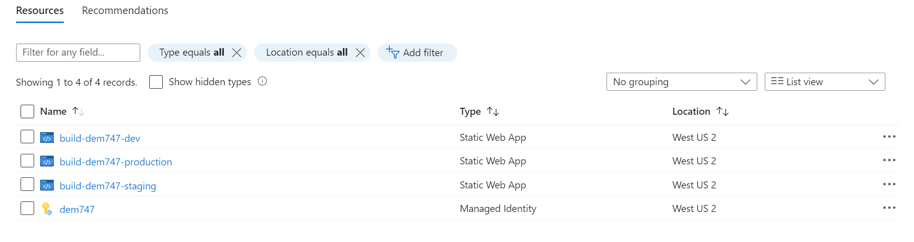

# Welcome to Microsoft Build DEM747

In this demo we are going to build, test and a deploy a website to Azure (static web app) using GitHub Actions.

Azure resources, authentication for workflows and GitHub repo settings have been pre configured in the interest of time.

## The Application

This repository hosts a basic [Next.js](https://nextjs.org/) application that can consume the
[GitHub Octodex](https://octodex.github.com/) RSS feed and then render the extracted feed
items into a web page so the Octocats can be viewed in all their glory and it also contains an API backend.

### Building

This is a standard Next.js application that uses the `next` framework to develop and build the application.

To run the application locally, use `npm run dev` from the checked out source code (after installing the dependencies of course using `npm install`). The application will start up and bind to port `3000` making the server available from http://localhost:3000

## Pre created Resources

In order for the demo to work these resources have been pre provisioned or configured.

### Azure Resources

Static Web Apps (one for each environment) and a Managed identity for deployment

### GitHub Actions Variables

### GitHub Actions Environments

Created QA and Production environments with protection rules

